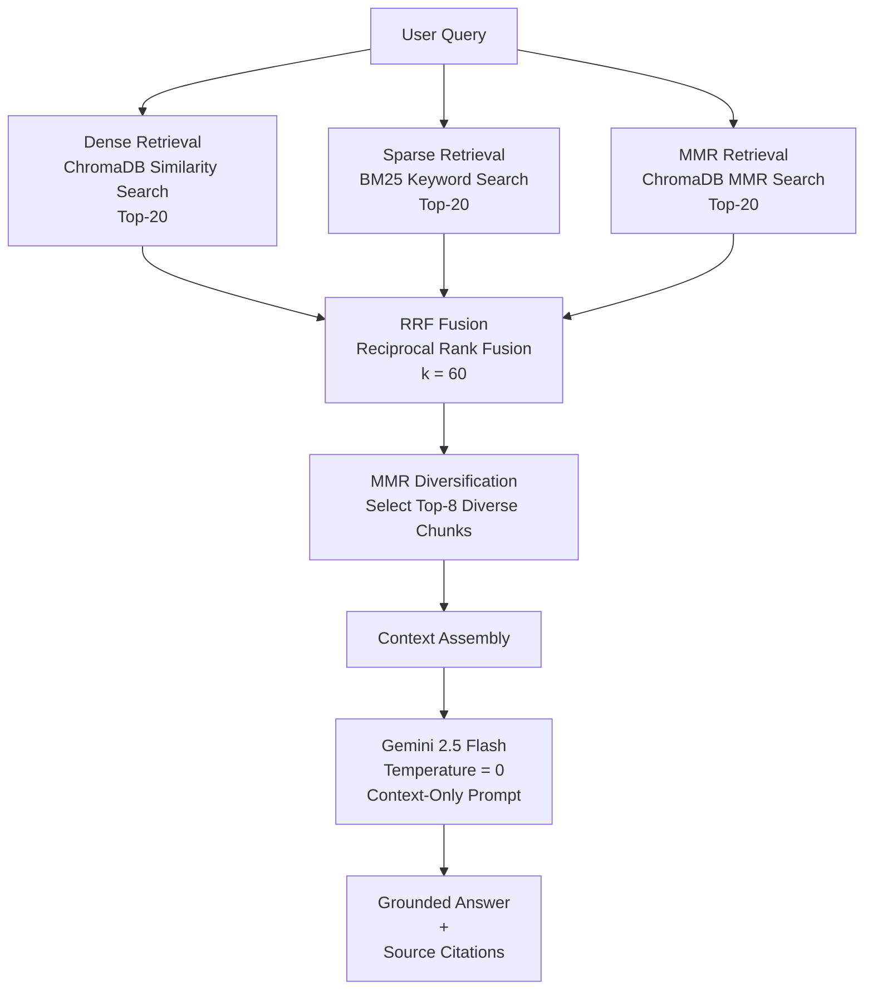
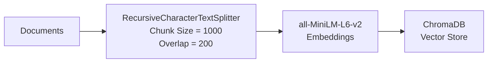

# ML Engineer Assessment — RAG System for AI Governance Documents

A Retrieval-Augmented Generation (RAG) system that answers questions over a corpus of AI governance documents. Retrieves relevant passages using hybrid search, fuses results with Reciprocal Rank Fusion, and generates grounded answers with source citations using Gemini 2.5 Flash.

---

## How It Works



**Ingestion pipeline:**



---

## Key Decisions

**Hybrid retrieval (dense + sparse + MMR)**
Dense retrieval captures semantic similarity but misses exact terminology (policy names, acronyms). BM25 fills that gap with keyword matching. The third MMR retriever adds a diverse set of semantically relevant candidates. All three are fused with RRF rather than picking one, which is more robust than any single retrieval strategy.

**RRF over learned fusion**
RRF (Reciprocal Rank Fusion) requires no training data and consistently outperforms simple score averaging in practice. The k=60 constant from the original paper dampens rank sensitivity — a document appearing at rank 1 in all three lists scores significantly higher than one appearing at rank 5.

**Post-RRF MMR diversification**
After fusion we have a single ranked list that can still contain semantically redundant chunks. A final MMR pass (λ=0.5) balances relevance against diversity, ensuring the 8 context chunks cover different facets of the answer rather than repeating the same passage.

**ChromaDB over a managed vector store**
Lightweight, local, and zero infrastructure overhead. Appropriate for assessment-scale workloads (11,625 chunks). Not a fit for production-scale or distributed ingestion.

**all-MiniLM-L6-v2 as the embedding model**
384-dimensional embeddings, fast indexing, strong baseline performance. BGE-M3 would give better multilingual and sparse support but is ~15× larger — the tradeoff isn't worth it for a single-language corpus.

**Temperature=0 + context-only system prompt**
Deterministic outputs and a hard constraint to only use retrieved context. If the corpus doesn't contain evidence, the model responds with a fixed fallback rather than hallucinating.

---

## Limitations

- **No reranker.** A cross-encoder reranker (e.g. bge-reranker-base) applied after RRF would improve answer quality but adds latency and model weight.
- **BM25 is rebuilt per query.** The BM25 index is constructed in-memory from ChromaDB's stored chunks on each call. Acceptable at this scale; would need caching for production.
- **ChromaDB is not production-grade.** Single-node, no distributed indexing, limited throughput.
- **Chunk metadata is sparse.** The dataset provides plain text files without embedded page numbers or section headings, so source citations reference the file name only.
- **No query rewriting.** Ambiguous or multi-hop questions are not decomposed before retrieval.

---

## Setup

**Prerequisites:** Python 3.11+, a Google AI Studio API key ([aistudio.google.com/apikey](https://aistudio.google.com/apikey))

```bash
git clone https://github.com/arehh04/ml-assessment.git
cd ml-assessment

pip install -r requirements.txt

cp .env.example .env
# Edit .env and set GOOGLE_API_KEY
```

**Download the dataset** (requires a Kaggle account):

```bash
pip install kagglehub
python -c "
import kagglehub, shutil, pathlib
src = pathlib.Path(kagglehub.dataset_download('umerhaddii/ai-governance-documents-data'))
dst = pathlib.Path('data/documents')
dst.mkdir(parents=True, exist_ok=True)
for f in (src / 'agora' / 'fulltext').iterdir():
    shutil.copy(f, dst)
print(f'Copied {len(list(dst.iterdir()))} documents')
"
```

**Ingest documents:**

```bash
python src/main.py --ingest
# Indexed 11625 chunks into ChromaDB at ./chroma_db
```

---

## Running Queries

```bash
python src/main.py --query "Your question here"
python src/main.py --query "Your question here" --top-k 5   # use 5 context chunks instead of 8
```

---

## Running Tests

```bash
pytest tests/ --ignore=tests/test_integration.py   # 58 unit tests, no API key needed
pytest tests/test_integration.py -m integration    # end-to-end, requires dataset + API key
```

---

## Test Queries

**Query 1: Core topic**

```
$ python src/main.py --query "What are the key principles of AI governance?"

Answer:
Key principles of AI governance include:
* Adopting a common set of ethical AI principles, such as those based on the OECD AI
  Principles, to assist regulators and stakeholders and nurture responsible AI innovation.
* Ensuring AI systems are robust, secure, and safe throughout their lifecycle, functioning
  appropriately and not posing unreasonable safety or security risks.
* Establishing accountability for the proper functioning of AI systems and adherence
  to principles.
* Implementing governance processes that catalog, review, and approve rights-impacting
  and safety-impacting uses of AI prior to deployment.
* Cultivating a framework that fosters safe, secure, and trustworthy AI development,
  manages AI risks, respects human rights, civil rights, civil liberties, and privacy.

Sources:
  - data\documents\1076.txt
  - data\documents\1026.txt
  - data\documents\1152.txt
  - data\documents\1377.txt
  - data\documents\764.txt
  - data\documents\1396.txt
  - data\documents\1356.txt
  - data\documents\1385.txt
```

**Query 2: Specific policy domain**

```
$ python src/main.py --query "How should the Department of Defense govern AI systems?"

Answer:
The Department of Defense should govern AI systems by:
* Improving coordination on AI governance with the defense industry sector.
* Establishing and overseeing AI guidance on ethical requirements and protections,
  and reducing or mitigating instances of unintended bias in AI algorithms.
* Reviewing AI program funding to ensure DoD investment adheres to all established
  AI policy.
* Taking appropriate measures to ensure responsible development, deployment, and use
  of military AI capabilities throughout their lifecycle.
* Prioritizing research to improve the security, robustness, and reliability of AI
  systems and controls, and partnering with agencies, industry, civil society, and academia.
* Developing and implementing an AI training program for the covered workforce.

Sources:
  - data\documents\403.txt
  - data\documents\1380.txt
  - data\documents\148.txt
  - data\documents\1385.txt
  - data\documents\399.txt
  - data\documents\772.txt
  - data\documents\27.txt
```

**Query 3: Out-of-corpus question (hallucination mitigation)**

```
$ python src/main.py --query "What does GDPR say about automated decision making?"

Answer:
I cannot find sufficient evidence in the provided documents to answer this question.
```

The corpus covers US federal AI policy and OECD principles — GDPR is not represented. The system correctly declines rather than fabricating an answer.

---

## Future Works

Given more time:

1. **Cross-encoder reranker** (bge-reranker-base) applied after RRF for better precision
2. **Query rewriting** to decompose multi-hop questions before retrieval
3. **Evaluation pipeline** — Recall@K, MRR, and faithfulness scoring against ground truth
4. **Metadata enrichment** — extract document titles and section headings during ingestion for richer citations
5. **Persistent BM25 index** — serialise and cache to avoid rebuilding on every query
